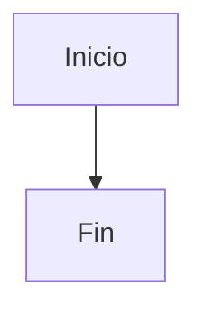

### **2.1. Diagrama de arquitectura:**

LexiMind implementa una **Arquitectura RAG (Retrieval-Augmented Generation)** distribuida con componentes especializados para el procesamiento de conocimiento bancario:

#### **Patrón Arquitectónico: RAG + Hexagonal**